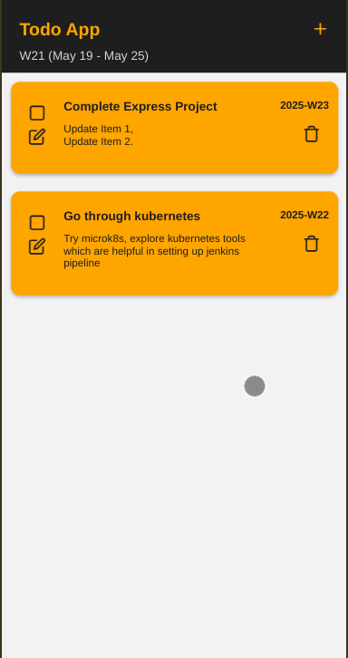
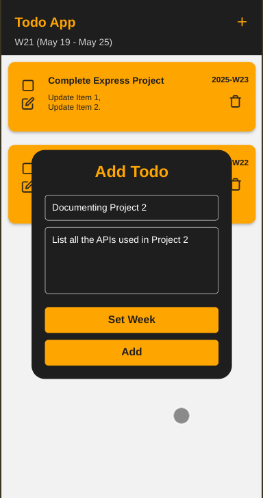
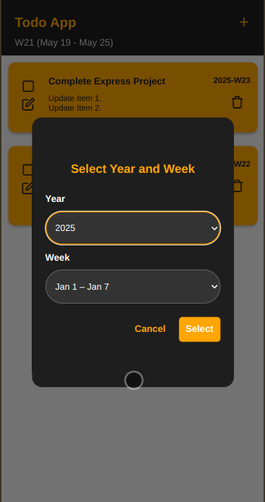
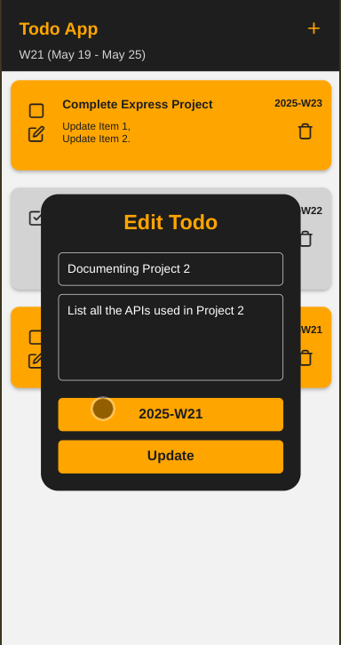
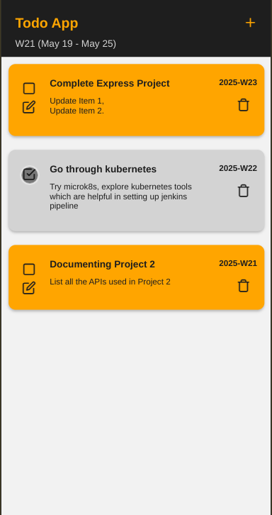

# 📝 TODO App

## 🎯 Project Objective

The goal of this project is to **explore and implement** a full-stack application using the following technologies:

### 🧰 Tech Stack


---

## 🚀 How to Run the Project

### 🔧 Prerequisites

* Node.js installed
* PostgreSQL installed and configured

### 📁 Setup Instructions

1. **Clone the Repository**

```bash
git clone <your-repo-url>
cd your-repo-folder
```

2. **Backend Setup**

* Navigate to the `server/` folder
* Create a `.env` file using `.env.example` as reference
* Make sure your PostgreSQL database is running and update credentials accordingly

```bash
cd server
npm install
npx prisma migrate dev
npm start
```

3. **Frontend Setup**

* Navigate to the `frontend/` folder (React Native with Expo)

```bash
cd ../frontend
npm install
npm start
```

> **Note:** Make sure your backend is running on port `4000` and the app connects to it correctly. Update the GraphQL URI in the frontend config if needed.

---

## 🛠 Database

* Only **one table** is required
* Prisma schema is located at:

```
/server/prisma/schema.prisma
```

---

## 🖼️ Screenshots

Here’s a preview of how the app works:

| Todos Listing                           | Add Todo                       | Select Week                          |
| --------------------------------------- | ------------------------------ | ------------------------------------ |
|  |  |  |

| Edit Todo                        | Update Status                            |
| -------------------------------- | ---------------------------------------- |
|  |  |

---

## 📌 Features

* Add and edit todos
* Assign week to each task
* Track completion status
* GraphQL-powered API
* Fully styled and responsive mobile UI

---
